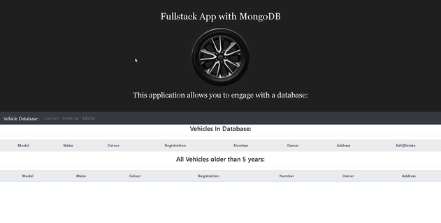

# full-stack-web-app
Full stack web application that allows users to add, edit or remove data from the database.
This web page is specifically formulated & designed to suit a car manafacturer that would like to keep track of all vehicles in its fleet.

## Semi-Fullstack Web Application

### Software requirements of the App:

#### System Architecture

##### Front-end
* I will be using React to create the Web App.
* The client(frontend) will be created using 'CRA'=> create-react-app(React) as the ReactJS framework.
* Within the React app, I'll be using Javascript, HTML & CSS.
* The React app will act as the user interface and offer the user experience.
* I've used some Css styling from the react-bootstrap as my styling framework as it is easy to use and speeds up styling needed for the app. 
  can be found @ ` http://getskeleton.com/ `.
* I will also be making use of custom style sheets where needed.

##### Database
* MongoDB will serve as the database which is where all user information and data will be stored, accessed and munipulated.

### Display of web application in action:

### Use of code:
* To use or edit code, load files to local drive.
* Open files in a text editor of your choice.
* Navigate to back end files, via the terminal & type "npm i" |or| "npm install" to install node-modules.
* Navigate to front end files, root directory of project, via the terminal and type "npm i" |or| "npm install" to install node-modules.
* Type "npm start" in both front and backend folders to run both front and back end after node-modules have been installed.
* The app should open up in your default browser and be available to use.

# How to run application?

* Cd to root project directory and install 'node_modules' with 'npm i' || 'npm install'.
* Type 'npm start' to open & run frontend in browser.
* Cd to backend folder and do the same by installing node module files with 'npm i'  || 'npm install'.
* Type 'npm start' to run backend server.
* The Application in the browser should now be ready for use.

This project was bootstrapped with [Create React App](https://github.com/facebook/create-react-app).

## Available Scripts

In the project directory, you can run:

### `npm start`

Runs the app in the development mode. 
Open [http://localhost:3000](http://localhost:3000) to view it in the browser.

The page will reload if you make edits. 
You will also see any lint errors in the console.

### `npm test`

Launches the test runner in the interactive watch mode. 
See the section about [running tests](https://facebook.github.io/create-react-app/docs/running-tests) for more information.

### `npm run build`

Builds the app for production to the `build` folder. 
It correctly bundles React in production mode and optimizes the build for the best performance.

The build is minified and the filenames include the hashes. 
Your app is ready to be deployed!

See the section about [deployment](https://facebook.github.io/create-react-app/docs/deployment) for more information.

### `npm run eject`

**Note: this is a one-way operation. Once you `eject`, you can’t go back!**

If you aren’t satisfied with the build tool and configuration choices, you can `eject` at any time. This command will remove the single build dependency from your project.

Instead, it will copy all the configuration files and the transitive dependencies (webpack, Babel, ESLint, etc) right into your project so you have full control over them. All of the commands except `eject` will still work, but they will point to the copied scripts so you can tweak them. At this point you’re on your own.

You don’t have to ever use `eject`. The curated feature set is suitable for small and middle deployments, and you shouldn’t feel obligated to use this feature. However we understand that this tool wouldn’t be useful if you couldn’t customize it when you are ready for it.

## Learn More

You can learn more in the [Create React App documentation](https://facebook.github.io/create-react-app/docs/getting-started).

To learn React, check out the [React documentation](https://reactjs.org/).

### Code Splitting

This section has moved here: https://facebook.github.io/create-react-app/docs/code-splitting

### Analyzing the Bundle Size

This section has moved here: https://facebook.github.io/create-react-app/docs/analyzing-the-bundle-size

### Making a Progressive Web App

This section has moved here: https://facebook.github.io/create-react-app/docs/making-a-progressive-web-app

### Advanced Configuration

This section has moved here: https://facebook.github.io/create-react-app/docs/advanced-configuration

### Deployment

This section has moved here: https://facebook.github.io/create-react-app/docs/deployment

### `npm run build` fails to minify

This section has moved here: https://facebook.github.io/create-react-app/docs/troubleshooting#npm-run-build-fails-to-minify

Happy Coding :sunglasses:
